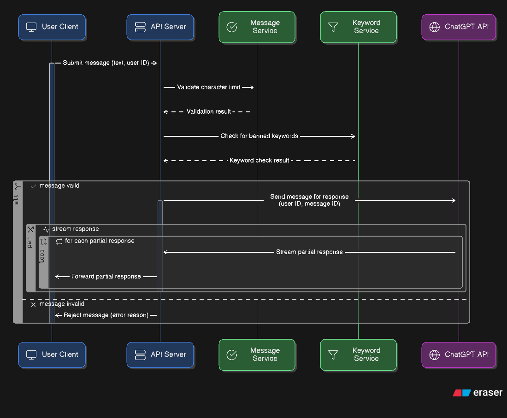

# ChatGPT Wrapper

A comprehensive backend service and frontend view that provides message management, keyword filtering, character limits, and OpenAI integration with streaming capabilities.

## Table of Contents

- [ChatGPT Wrapper](#chatgpt-wrapper)
  - [Table of Contents](#table-of-contents)
  - [Overview](#overview)
  - [Features](#features)
  - [Prerequisites](#prerequisites)
  - [Installation](#installation)
  - [API Documentation](#api-documentation)
    - [Character Limit Management](#character-limit-management)
      - [POST /char-limit](#post-char-limit)
      - [GET /char-limit](#get-char-limit)
    - [Keyword Management](#keyword-management)
      - [POST /lemmatized-keywords](#post-lemmatized-keywords)
      - [GET /lemmatized-keywords](#get-lemmatized-keywords)
    - [Message Management](#message-management)
      - [POST /messages](#post-messages)
      - [GET /messages](#get-messages)
    - [OpenAI Integration](#openai-integration)
      - [GET /ask-chatgpt](#get-ask-chatgpt)
  - [Usage Steps without Frontend](#usage-steps-without-frontend)
    - [1. Set Character Limit](#1-set-character-limit)
    - [2. Add Forbidden Keywords](#2-add-forbidden-keywords)
    - [3. Post Messages](#3-post-messages)
    - [4. Stream ChatGPT Responses](#4-stream-chatgpt-responses)
  - [Frontend Sequence Diagram](#frontend-sequence-diagram)
  - [CORS Configuration](#cors-configuration)
  - [Running the Service](#running-the-service)
  - [Dependencies](#dependencies)
  - [Lemmatization](#lemmatization)
  - [Stemming](#stemming)
  - [Improvements](#Improvements)

## Overview

Backend service acts as a BFF (Backend for Frontend) that provides:
- Message posting and retrieval with content moderation
- Character limit enforcement
- Keyword-based content filtering using lemmatization
- Real-time streaming integration with OpenAI's ChatGPT API
- Basic Validation

Frontend View to integrate with the BFF service
- Store History of current and previous chats in localStorage
- Generate User Id
- Real-time streaming integration with the BFF service
- Basic validation on character count

## Features

- **Message Management**: Post and retrieve user messages
- **Content Moderation**: Keyword filtering with lemmatization support
- **Character Limits**: Configurable character limits for message validation
- **Real-time Streaming**: Server-Sent Events (SSE) integration with OpenAI
- **User Authentication**: Basic user-based message validation

## Prerequisites

- Go 1.24.4 or higher
- OpenAI API key

## Installation

1. Clone the repository:
```bash
git clone https://github.com/PeterMagdyIskander/chatgpt-wrapper.git
cd chatgpt-wrapper/BFF
```

2. Install dependencies:
```bash
go get .
```

3. Create a `.env` file in the BFF directory:
```bash
OPENAI_API_KEY=your_openai_api_key_here
```

4. Run the backend:
```bash
go run .
```

5. Go to chatgpt-wrapper/chatgpt-wrapper-fe in a separate terminal:
```bash
npm i
```

6. Run the frontend:
```bash
npm run start
```

## API Documentation

### Character Limit Management

#### POST /char-limit
Set the maximum character limit for messages.

**Request Body:**
```json
{
  "charLimit": 1000
}
```

**Response (200):**
```json
{
  "charLimit": 1000
}
```

#### GET /char-limit
Get the current character limit configuration.

**Response (200):**
```json
{
  "charLimit": 1000
}
```

### Keyword Management

#### POST /lemmatized-keywords
Add forbidden keywords to the content filter. Keywords are automatically lemmatized for better matching.

**Request Body:**
```json
{
  "keywords": ["spam", "inappropriate", "forbidden"]
}
```

**Response (201):**
```json
{
  "message": "Lemmatized keywords added",
  "count": 3
}
```

**Response (Validation Error - 400):**
```json
{
  "error": "The 'keywords' array cannot be empty."
}
```

#### GET /lemmatized-keywords
Retrieve all currently configured forbidden keywords.

**Response (200):**
```json
[
  "spam",
  "inappropriate", 
  "forbidden"
]
```

### Message Management

#### POST /messages
Post a new user message with content validation and keyword filtering.

**Request Body:**
```json
{
  "message": "Your message content here",
  "userId": "user123"
}
```

**Response (Success - 200):**
```json
{
  "messageId": "msg_1703123456789123456",
  "message": "Message posted successfully",
  "status": "approved"
}
```

**Response (Content Violation - 400):**
```json
{
  "error": "Message contains forbidden keywords",
  "messageId": "msg_1703123456789123456",
  "foundKeywords": ["forbidden", "words"],
  "message": "Your message has been saved but contains prohibited content"
}
```

**Response (Validation Error - 400):**
```json
{
  "error": "Message cannot be empty"
}
```

**Validation Rules:**
- Message content cannot be empty
- Message length must not exceed the configured character limit
- UserId cannot be empty
- Messages containing forbidden keywords are flagged but still saved

#### GET /messages
Retrieve all messages from the system.

**Response (200):**
```json
[
  {
    "MessageId": "msg_1703123456789123456",
    "UserId": "user123",
    "Flagged": false,
    "MessageContent": "Hello, world!"
  }
]
```


### OpenAI Integration

#### GET /ask-chatgpt
Stream ChatGPT responses using Server-Sent Events (SSE).

**Query Parameters:**
- `userId` (required): The user ID requesting the response
- `messageId` (required): The ID of the message to process

**Example Request:**
```
GET /ask-chatgpt?userId=user123&messageId=msg_1703123456789123456
```

**SSE Event Types:**
- `connection`: Initial connection confirmation
- `data`: Streaming response chunks from ChatGPT
- `error`: Error messages
- `done`: Stream completion notification

**Response Headers:**
```
Content-Type: text/event-stream
Cache-Control: no-cache
Connection: keep-alive
Access-Control-Allow-Origin: *
```

**Example SSE Response:**
```
event: connection
data: Connected to OpenAI stream

event: data
data: Hello! How can I help you today?

event: done
data: Stream completed
```

**Validation Rules:**
- Message must exist and belong to the specified user
- Message must not be flagged for containing forbidden keywords

## Usage Steps without Frontend

To use this backend service effectively, follow these steps:

### 1. Set Character Limit
First, configure the character limit for message validation:

```bash
curl -X POST http://localhost:8081/char-limit \
  -H "Content-Type: application/json" \
  -d '{"charLimit": 1000}'
```

### 2. Add Forbidden Keywords
Configure the content filter with lemmatized keywords:

```bash
curl -X POST http://localhost:8081/lemmatized-keywords \
  -H "Content-Type: application/json" \
  -d '{"keywords": ["spam", "inappropriate", "forbidden", "blocked"]}'
```

### 3. Post Messages
Users can now post messages that will be validated against the character limit and keyword filter:

```bash
curl -X POST http://localhost:8081/messages \
  -H "Content-Type: application/json" \
  -d '{"message": "Hello, this is a test message", "userId": "user123"}'
```

### 4. Stream ChatGPT Responses
For approved messages, users can request ChatGPT responses:

```bash
curl -N http://localhost:8081/ask-chatgpt?userId=user123&messageId=msg_1703123456789123456
```
## Frontend Sequence Diagram


## CORS Configuration

The service is configured with CORS support for the following:
- **Allowed Origins**: `http://localhost:8080`
- **Allowed Methods**: GET, POST, PUT, DELETE, OPTIONS
- **Allowed Headers**: Origin, Content-Type, Authorization
- **Credentials**: Enabled

To modify CORS settings, update the configuration in `main.go`.

## Running the Service

1. Ensure your `.env` file is configured with your OpenAI API key
2. Start the service:
```bash
go run main.go
```

The service will start on port 8081. You should see:
```
Server starting on :8081
Make sure to set OPENAI_API_KEY environment variable
```

## Dependencies

- **Gin**: HTTP web framework
- **Gin CORS**: CORS middleware
- **Godotenv**: Environment variable management
- **Golem**: Lemmatization library for keyword processing
- **OpenAI API**: ChatGPT integration

## Lemmatization

- The problem was that, if we inserted every variation of the word, 
- we will populate the memory with a lot of duplicated, so lemmatizaiton was the solution
- so that we group different forms of the same words.
- Also added a hashset for o(1) searching through the words

## Stemming

- Stemming removes the common suffixes from the end of a word, which isn't exactly what we need, this is why I went with Lemmatization

## Improvements

- Docker compose for the whole app
- Disconnect the connection to chatgpt, if the user disconnects prematurely